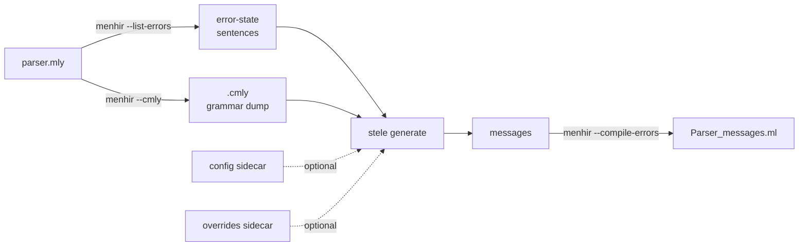

# stele

Machine-generated, user-friendly syntax-error messages for any
[Menhir](https://gitlab.inria.fr/fpottier/menhir) grammar.

When a parser meets input it cannot accept, it fails. By default your users see
only "Syntax error", with no hint of what was expected or where. Menhir can show
a real message instead, but only if you write one for every point where the
parse can get stuck, and a realistic grammar has hundreds of them, each needing
an update whenever the grammar changes. Writing and maintaining that by hand is
the hard part.

stele writes those messages for you. It reads the grammar itself, works out what
each failure point would have accepted next, and phrases it in plain terms
("Expecting ')', ';', or an operator."). It then guards the result with
promoted golden files, so a grammar change shows up as a reviewable diff of the
messages rather than as silent staleness.

It powers the error messages of both grammars in the
[Wax](https://github.com/ocsigen/wax) toolchain (WebAssembly text and the Wax
language).

New here? Start with [TUTORIAL.md](TUTORIAL.md): a ten-stage walkthrough
that takes a tiny calculator grammar from menhir's bare "Syntax error" to
the full setup, with the same error shown improving at every stage. Its
final state is the runnable example in `example/`.

> Two honest caveats. The message templates are English-only. And the
> heuristics are validated on exactly two grammars, so adopters will find edges.

**This README, in reading order.** [Install](#install) and
[Quick start](#quick-start) get you a first message. [A minute of
vocabulary](#a-minute-of-vocabulary) and [What it produces](#what-it-produces)
explain the pieces. [The config format](#the-config-format) and
[Naming](#naming) are where you improve the wording. [The runtime
helper](#the-runtime-helper) and [The annotation tuner](#the-annotation-tuner)
are advanced and can wait. Stuck? See [Troubleshooting](#troubleshooting).

## Install

stele is a standard dune/opam project; you need OCaml (`>= 4.14`) and menhir.
Once it is published to opam:

```
opam install stele
```

From a source checkout today, `opam install .` (or just `dune build`) does the
same. Either way you get two things: the `stele` executable (the build-time
generator) and the `stele.runtime` library (the small helper your parser links).
menhir is only a build-time dependency; at run time your parser calls just
`stele.runtime`, which depends on `menhirLib` and the standard library alone (so
it also builds under `js_of_ocaml` / `wasm_of_ocaml`).

## Quick start

The smallest useful wiring needs no config and no golden files. Given your
`parser.mly`, add four dune rules:

```lisp
; 1. the error states, one sample sentence each
(rule (with-stdout-to msgs.auto
        (run menhir %{dep:parser.mly} --list-errors)))

; 2. a machine-readable dump of the grammar
(rule (target parser.cmly) (deps parser.mly)
      (action (run menhir %{dep:parser.mly} --cmly --no-code-generation --base parser)))

; 3. stele turns those two into a message per state ...
(rule (with-stdout-to msgs.full
        (run stele generate --cmly %{dep:parser.cmly} %{dep:msgs.auto})))

; 4. ... which menhir compiles into a module your parser queries
(rule (with-stdout-to parser_messages.ml
        (run menhir %{dep:parser.mly} --compile-errors %{dep:msgs.full})))
```

`Parser_messages.message : int -> string` now maps each error state to a
message; call it from your parser's error handler. That is the whole loop.
From here you alias your tokens, add a `--config` to improve the wording, pin
golden files so changes stay reviewable, and resolve the location markers at
runtime. The [tutorial](TUTORIAL.md) builds all of that up one stage at a time,
and [The pipeline](#the-pipeline-dune-rules) shows the full version with golden
checks.

## A minute of vocabulary

A few terms recur below. Here is the short version; you do not need parsing
theory to use stele.

- **Error state.** As a parser reads input it moves through internal states. An
  *error state* is one it enters only on input it cannot accept, so each error
  state is one specific way a parse can fail. `menhir --list-errors` lists every
  one, each with a sample input that reaches it. A realistic grammar has
  hundreds.
- **The two Menhir commands.** `--list-errors` enumerates the error states;
  `--compile-errors` takes one message per state and compiles them into an OCaml
  module (`Parser_messages`) that your parser queries by state number when it
  fails. stele is the step in between: it writes the messages.
- **`.cmly`.** A machine-readable dump of the compiled grammar
  (`menhir --cmly`). stele reads it so its messages reflect the real rules
  rather than a guess.
- **Expecting list.** For one error state, the tokens or constructs the parser
  would have accepted next. stele computes this from the grammar and renders it
  in prose.

## What it produces

For each error state (each way the parse can fail), stele produces:

- an **Expecting** list of what was legal next, computed from the grammar
  itself (its rules, which of them can match nothing, and the tokens each can
  begin with, its *FIRST set*), rendered with readable names and capped at five
  items ("Expecting ')', ';', or an operator.").
- a **delimiter hint** that points back at the opening `(` / `[` / `{` the
  parser was still inside ("`<2>This '{' opens the enclosing construct.`"). The
  `<N>` is a placeholder; the runtime helper fills it in with the real source
  location from the live parser stack.
- a **hedge**, for the case where the parser has fully read a construct before
  failing. Instead of re-listing everything that construct could contain, the
  message assumes it is finished ("Assuming that the statements are complete,
  expecting '}'."). A `<^1>these statements` **subject marker** tells the
  runtime helper to underline the whole finished construct. These arise where
  the grammar carries an `%on_error_reduce` annotation (explained under
  [Naming](#naming)).
- a **hand override** for the handful of states the heuristics cannot serve.

stele also checks its own output. A **soundness oracle** verifies that every
token it claims was legal really is legal in that state (against the compiled
parser), and a **state-correspondence** check confirms the `.messages` and the
`.cmly` agree on the state numbering. That second check is what lets stele trust
its two inputs against each other; keep it in mind when debugging.

## The pipeline (dune rules)

The generator runs at build time. You wire four steps: menhir lists the error
states, menhir dumps the grammar, stele writes the messages, and menhir compiles
them into the module your parser calls. The two sidecars (config and overrides)
are optional refinements.



See [`example/dune`](example/dune) for the complete, runnable miniature. In outline:

```lisp
; 1. representative error sentences, one per error state
(rule (with-stdout-to g.auto.messages
        (run menhir %{dep:parser.mly} --list-errors)))

; 2. the exact grammar (--no-code-generation keeps --cmly from running the
;    code back-end, which would need dune's type inference)
(rule (target g.cmly) (deps parser.mly)
      (action (run menhir %{dep:parser.mly} --cmly --no-code-generation --base g)))

; 3. the generated messages, comments stripped and sorted (the golden projection)
(rule (with-stdout-to g.actual
        (run stele generate
             --no-comments --cmly %{dep:g.cmly} --config %{dep:parser_messages.config}
             --overrides %{dep:parser_messages.overrides} %{dep:g.auto.messages})))
(rule (alias runtest) (action (diff parser_messages.expected g.actual)))

; 4. the full messages (with comments), compiled into a Parser_messages module
(rule (with-stdout-to g.messages
        (run stele generate
             --cmly %{dep:g.cmly} --config %{dep:parser_messages.config}
             --overrides %{dep:parser_messages.overrides} %{dep:g.auto.messages})))
(rule (with-stdout-to parser_messages.ml
        (run menhir %{dep:parser.mly} --compile-errors %{dep:g.messages})))
```

`Parser_messages.message : int -> string` is what the parser calls at an error.

## The command line

stele is a `Cmd.group` of subcommands, one per output: `generate`
(`--no-comments` for the golden projection), `stats`, `census`, `names`,
`fallbacks`, `suggest-classes`, and `transitions`. Each takes the same inputs:
the required `--cmly FILE`, the optional `--config FILE` / `--overrides FILE`,
and the positional `.messages` file. So every command line reads
`stele <command> --cmly g.cmly [--config …] [--overrides …] g.messages`. Run
`stele --help` or `stele <command> --help` for the man pages. A subcommand runs
exactly one mode; the modes do not compose in a single invocation (the earlier
single-dash CLI concatenated their output, but nothing used the combination).

One further command, `stele tune`, is itself a group (`dead` / `advise` /
`calibrate`) with a different input shape: it generates the `.cmly` and
`.messages` itself, once per trial, from a `--grammar FILE.mly` via a `--menhir`
subprocess. See [The annotation tuner](#the-annotation-tuner).

## The three-goldens promote loop

A *golden file* is a committed copy of expected output: a test compares freshly
generated output against it and fails on any difference, and `dune promote`
updates the committed copy once you have reviewed the change. stele emits three
views of each generation; pin each as its own golden:

| Golden | Mode | What it pins |
|---|---|---|
| `parser_messages.expected` | `stele generate --no-comments` | the sentence to message projection (sorted by sentence, so a state renumber does not churn it) |
| `parser_messages.stats.expected` | `stele stats` | the quality counters and self-lints (the ratchet) |
| `parser_messages.census.expected` | `stele census` | the distinct message bodies with counts (the compact wording surface) |

The loop for any grammar or generator change: `dune runtest`, read the three
diffs, then `dune promote`. A message diff you agree with is fine; a **stats**
counter moving the wrong way without a message-diff justification means the
change regressed quality. Never hand-edit a `.expected` file.

Useful modes while working, at a glance:

| Mode | Prints | Reach for it when |
|---|---|---|
| `stats` | quality counters and self-lints | you want a one-glance health check, or to judge whether a golden diff is a regression |
| `census` | each distinct message body once, with counts | you are reviewing a wording change across many states |
| `names` | how every symbol becomes words, with its provenance | a rendering reads wrong and you need to know which rule produced it |
| `fallbacks` | a ready-to-paste `.overrides` block per uncovered "Syntax error" state | a state degraded to the generic message and you want to hand-write it |
| `suggest-classes` | candidate `[class]` blocks that would shorten long lists | an Expecting list is too long and several tokens always appear together |

In detail:

- `stats` prints the counters: entries, with-an-expected-list, fallbacks (empty
  and over-cap, split by whether an override covers them), delimiter hints,
  missed hints, jargon, cascade depth, and the oracle lines (`state/automaton
  item-set match`, `unsound claims`, uncovered actions). It ends with one
  **dormancy line per configured class**, in file order:

  ```
  class "an operator": collapsed in 33 entries
  ```

  `N` is how many entries had the class collapse fire in their computed expected
  list (two or more members co-occurring). It counts the collapse computation,
  not the shown text: an override or an over-cap overflow may supersede the
  phrase, yet the class is live while its members co-occur. `N = 0` is legitimate
  (a class waiting for a qualifying state), but the ratchet now makes a class
  going quiet after a grammar change visible as a stats diff. A grammar with no
  classes prints no such line.
- `census` prints each distinct message body once with its occurrence count,
  the delimiter-hint depth normalized to `<_>`, so sentence re-picking at most
  bumps a count and a wording change is a one-line diff.
- `names` reviews how every symbol reaches its wording: a table of each symbol
  that surfaces in the emitted messages with its rendered form, the pipeline
  step that produced it (token alias, `[names]` entry, the list-element chase,
  the Assuming-subject plural rendering, the lowercase auto-derivation, a
  `[class]` label, or the quoted-lowercase fallback), and how often it appears
  in the Expecting list versus the Assuming subject. Usage is counted per
  position because a symbol can render differently in each (a list name
  singularises via the chase in the Expecting list but keeps its plural as a
  subject) and a `[names]` entry can be dead in one position yet live in the
  other. After the table it lists any `[names]` entries whose curated phrase won
  in neither position. The audit surface for two directions: awkward auto-derived
  or fallback renderings that deserve a `[names]` entry (a quoted-lowercase
  fallback that is not a real keyword, i.e. a token name shown as if it were
  literal syntax), and `[names]` entries nothing uses. `stats` mirrors the
  second half as the ratchet: a `names configured: X, unused: Y` line plus one
  indented per-position line per fully-unused entry, so an entry going quiet
  becomes a golden diff.
- `fallbacks` prints a ready-to-paste `.overrides` block for every
  generic-fallback ("Syntax error") state not yet overridden. Empty output means
  every fallback is covered, the condition the stats ratchet pins at zero.
- `suggest-classes` proposes new `[class]` blocks for the config. It clusters
  unclassed terminals by their **signature** (the set of entries whose raw
  expected list mentions them); terminals with the identical signature always
  co-occur, so collapsing them never drops a token a single state needed. It
  keeps clusters of three or more, ranks them by how many entries the collapse
  newly fits under the cap (then by list-item reduction), and emits paste-ready
  blocks with impact `#` comments and a `<LABEL>` placeholder:

  ```
  # cluster of 5 tokens co-occurring in 6 state(s); collapsing them
  # newly fits 4 entrie(s) under the <=5 cap and removes 24 list item(s).
  [class <LABEL>]
  BLOCK
  IF
  LOOP
  TRY
  TRY_TABLE
  ```

  Like every command it needs `--cmly`. Because arithmetic
  and comparison operators are often legal in exactly the same states, they share
  a signature and land in one cluster; splitting them into two readable labels is
  the human decision the config records.

Wiring each mode as a per-grammar dune alias (with the four artifact paths
baked in once and a `(universe)` dep so a re-run re-prints) saves retyping them
and stops a hand run from silently dropping `--overrides`. The inspection modes
are cheap; the two `tune` modes re-run menhir once per trial and take tens of
seconds, so wire them to run only when asked.

## The `.overrides` file

A *sidecar* is a small file kept beside the grammar that feeds stele
grammar-specific information. The `.overrides` sidecar holds hand-written
messages for the few states the heuristics cannot serve well, mainly the start
of a long enumeration, where the list of what could legally come next is simply
too long to read (its FIRST set overflows the five-item cap). Each override is
keyed by the **sentence** (the sample input for its state), which stays stable
when states are renumbered, and is merged in after generation. Format: blocks
separated by blank lines; within a block, `#` lines are comments, the first
surviving line is the `entry_point: sentence` header, and the rest is the
replacement body (one message line, optionally followed by a
`<N>This '(' opens …` delimiter-hint line).

**Rot guard.** An override whose sentence matches no live error state fails the
build, so the file cannot drift silently. When a grammar change births a new
fallback, run `-list-fallbacks`, paste the block, and write the message in place
of the placeholder.

## The config format

The config sidecar is where you improve the wording of messages without
touching the generator. It holds everything grammar-specific that stele cannot
read from the `.cmly`, which keeps the generator itself grammar-agnostic. It is
a small line format: `#` comments and blank lines anywhere, `[section]` headers,
one entry per line. With no config at all, stele falls back to no curated names,
no classes, and delimiter hints from token aliases only. Four sections, all
optional:

```
# Readable names for symbols whose auto-derived rendering would be jargon or
# grammatically wrong. NAME = readable phrase.
[names]
IDENT = an identifier
stmts = statements

# Token classes collapsed to one readable label before the <=5 cap. One member
# terminal per line; a class fires only when >=2 of its members are legal in a
# state, so a lone member keeps its own spelling. The header repeats per class.
[class an operator]
PLUS
STAR

# Help stele recognise an opening delimiter it would otherwise miss. It already
# treats any token whose alias begins with '(' / '[' / '{' as an opener; add a
# line here for one it should also match by the token's name.
# Format: OPENER_CHAR KIND ARG, where KIND is prefix | suffix | exact.
[opener-nets]
( prefix LPAREN
{ exact LBRACE

# Rarely needed. stele names a helper rule like list(X) by expanding it into its
# contents rather than printing "a list(X)", and decides which rules are such
# helpers from their shape (a list- or option-shaped body). If your grammar has
# a home-grown combinator whose shape fools that test, list its name (the text
# before the '(') here to force the expansion. Usually empty, since the shape
# test already recognises the standard combinators.
[wrappers]
my_list_combinator
```

For a complete, working example, see the calc grammar's
[`example/calc.config`](example/calc.config): two sections, a dozen lines.

Delimiter **closers** need no config at all: a terminal whose alias *ends* with
`)` / `]` / `}` is a closer of that kind, mirroring the opener rule (an alias
*beginning* with `(` / `[` / `{`), so a multi-character delimiter like `[|` /
`|]` is recognized just as a compound opener like `(then` is. A grammar that
aliases its delimiters gets hints for free; one that does not simply gets none.

The exact **opener↔closer pairs** are derived from the grammar's productions,
not guessed from the shared bracket kind: in each production a closer mates the
nearest still-open opener of the same character (a stack pop over the
right-hand side), collected over every production. The balance scan then pairs
per exact token, so a plain `[` `]` and a compound `[|` `|]` that share the `[`
kind stay distinct: a `]` never matches a `[|`, and an invisible `|]` no longer
walks the scan past the wrong opener. The hint names, and the runtime underlines,
the opener's full alias: a closer with a unique mate prints that mate verbatim
(`This '[|' opens …`, underlined two columns), while a closer with several mates
(a `)` that pairs with `(`, `(then`, `(param`, … across productions) falls back
to the shared opener character. The `[|`/`|]` coexistence is exercised by the
`delim` test grammar under `stele/test/delim/`.

The config is per-grammar: every entry must name a symbol that grammar actually
has, so two grammars do not share one file.

**Rot guard.** Like the `.overrides` file, the config is checked at load (in
every config-consuming mode, which already reads the `.cmly`). A `[class]`
member that is not a terminal, a `[names]` key that is neither a terminal nor a
nonterminal, an `[opener-nets]` pattern that matches no terminal, or a
`[wrappers]` head that is the base of no parameterized nonterminal is a hard
error naming the file, section, and stale entry, so a config left behind by a
grammar change fails the build instead of firing on nothing. Use
`stele suggest-classes` to discover new classes worth adding, and
`stele names` to audit the whole naming surface.

## Naming

How a symbol becomes words in a message, in precedence order:

1. A token alias renders as the quoted alias: `')'`, `'(export'`.
2. A `[names]` config entry renders as its phrase.
3. In the "Expecting" position, a list-shaped nonterminal is chased to its
   leftmost mandatory symbol, so the message names one element (or the
   leading keyword) instead of the list: "a parameter" rather than
   "a parameter list". The chase only fires when every non-empty production
   starts with the same symbol; a list with several distinct element openers
   keeps its list name, which is the honest reading.
4. A lowercase nonterminal is auto-derived: underscores become spaces and an
   article is added (`condition_expression` reads "a condition expression").
   A plural head drops the article and agrees in the "Assuming that the X
   are complete" template.
5. A `[class LABEL]` collapses its member tokens into the label.
6. An unaliased ALL-CAPS terminal falls back to its quoted lowercase name.
   This is right for keywords (`'func'`, `'mut'`) and wrong for value tokens
   (an identifier token would read `'id'` as if the user should type the
   letters). The jargon lint flags multi-word cases; single-word cases need
   the `stele names` audit.

The practical consequence: **your nonterminal names are the message
vocabulary**. The generator deliberately keeps a user-named nonterminal
opaque, saying "an expression" rather than enumerating its FIRST set, so a
name that reads as a noun phrase is a better error message with no further
work.

Three techniques follow. The first two are ordinary grammar tidying; the third
addresses a specific, more advanced problem and can wait until you meet it.

- **Add a rule purely to name a construct.** Instead of inlining a wrapper
  at the use site:

  ```
  structure: "{" separated_list_trailing(",", structure_type_field) "}"
  ```

  factor it through a named nonterminal:

  ```
  structure: "{" l = structure_type "}"
  structure_type: separated_list_trailing(",", structure_type_field)
  ```

  Messages now say "a structure type" instead of exposing wrapper internals.
  The named rule is also a valid `%on_error_reduce` target, which gives the
  hedge a good subject. Do not `%inline` such a rule: an inlined rule
  vanishes from the automaton, and the name only exists if the nonterminal
  does.

- **Name the element of a list.** A list rule whose element is spelled out
  inline chases to the element's first token; factoring the element into its
  own rule makes the chase land on the construct name:

  ```
  exports: /* empty */ | n = export r = exports
  export: "(export" n = name ")"
  ```

  renders "an export" where the inline form rendered `'(export'`.

- **Split a shared rule to unblend contexts.** (Advanced.) The symptom: a
  message offers continuations that make no sense together, because it lists
  options from two different places the same rule is used. This happens when one
  nonterminal serves several syntactic homes: menhir merges their error states,
  and the message ends up listing what could follow in *either* home even though
  the user is only ever in one. Example: a
  `function_type` rule used both by a declaration (`fn f() -> t { ... }`,
  where only `->` and `{` can follow) and as a type inside expressions
  (where the surrounding expression's operators follow) produces one state
  whose message offers both.

  The preferred fix is a **phantom parameter** (Pottier, "Reachability and
  Error Diagnosis in LR(1) Parsers", CC 2016, §4 "Selective Duplication").
  Parameterize the rule with an unused formal and instantiate it at each home
  with a distinct argument:

  ```
  function_type(ctx):                (* ctx is unused: a phantom *)
    | "(" p = parameter_list ")" ioption("->" result_type) { ... }
  ```

  used as, say, `function_type(TYPE)` at the type homes and
  `function_type(FN)` at the declaration. Any two distinct symbols the
  grammar already uses will do as arguments: the parameter never appears in
  the body, and the instantiation name never reaches a message, so the
  choice is cosmetic; pick evocative ones and leave a comment. (Fresh empty
  marker nonterminals also work but make menhir warn that they are
  unreachable, and there is no flag to silence that warning class.) Menhir
  expands the two instantiations to distinct automaton nonterminals with
  their own LR items, so the states stop merging and each home gets its own
  precise message ("Expecting '->', or '{'." for the declaration). One
  definition, no copies to keep in step.
  stele renders the instantiation opaquely by its base name ("a function
  type"), because it classifies wrappers structurally (list- or option-shaped
  bodies), not by the '(' in the name; a phantom split is neither shape, so it
  stays a named construct. (If the structural test ever misjudged a real
  wrapper as a construct, the `[wrappers]` config section forces it to expand.)

  The **textual-duplication fallback** does the same split without a
  parameter, for a grammar that cannot use the phantom form: copy the rule
  under a second name with identical productions
  (`function_signature: | "(" p = parameter_list ")" { ... } | ...`). Distinct
  nonterminals, distinct LR items, same effect; the cost is keeping the two
  copies in step. The symptom to hunt for either form: a message mixing
  vocabularies no single context accepts. Nothing mechanical flags this class
  (a hand-written override saying too much is sound token by token), so it is
  found by reading the census, or an override against its own sentence.

  `%on_error_reduce` on the shared rule is the lighter alternative when
  the state has a completed production: the spurious reduction's goto
  lands in a context-specific state, so the report unblends without
  duplicating anything. The trade: continuations still inside the
  construct fold into the hedge ("Assuming that the function type is
  complete, expecting '{'." hides the '->' option), so prefer the
  annotation when the completed reading dominates, and duplication when
  in-construct continuations must stay visible.

- **Alias every token with its source spelling**, including multi-character
  openers (`"(then"`, `"(@if"`). Aliases feed both the rendering and the
  delimiter-hint machinery for free.

Prefer a grammar rename over a `[names]` entry when both would work; the
config entry is for names that are right for the grammar but wrong for
prose.

## The runtime helper

This section is for whoever wires stele's output into a parser's error handler,
a one-time setup. A generated message can point at a location in the source (the
opening delimiter, or the span of a finished construct), but the message is
written before the parse runs, so it cannot know where that location is yet. It
leaves a placeholder for the runtime to fill in.

Concretely, a message may carry two marker kinds, both a 1-based index `N` into
the parser's stack: a **delimiter hint** `<N>This '(' opens …` and a **hedge
subject** `<^N>this expression`. Resolving either needs the running parser's
environment, so the adopter's error handler does it, once, via the
`stele.runtime` library (`Parser_error_runtime`). It is a functor over the
minimal slice of a Menhir incremental engine it needs, and depends on `menhirLib`
and the standard library only (so it compiles under `js_of_ocaml` /
`wasm_of_ocaml` too):

```ocaml
module R = Parser_error_runtime.Make (struct
  type 'a env = 'a MenhirInterpreter.env
  type element = MenhirInterpreter.element
  let get = MenhirInterpreter.get
  let positions (MenhirInterpreter.Element (_, _, p1, p2)) = (p1, p2)
end)

(* At a HandlingError checkpoint, with [env] the error environment: *)
let main_message, labels =
  R.resolve ~source ~env (Parser_messages.message state)
(* [labels] carries, per marker, a source span and the label text. For <N>, a
   span at the opening delimiter as wide as the alias the label names (one column
   for a plain '(', two for a compound '[|'; walked back over blanks when the
   cell's start is not itself the delimiter). For <^N>, the whole construct's
   span (across as many lines as it crosses; the diagnostic renderer draws a
   multi-line span as a spine), dropped when it is zero-width (an empty
   construct). Labels come back in emission order, subject before delimiter
   hint. *)
```

The two markers extend one vocabulary compatibly: a resolver that understands
only `<N>` leaves a `<^N>` line inline (the `^`-tagged depth fails its integer
parse), so a newer generator's output stays readable to an older helper.

What you do with `main_message` and `labels` is up to you: stele stops at the
message text and the resolved source spans, and stays renderer-agnostic. To
produce output like the tutorial's (the source line with `^` underlines and
margin labels), hand them to a source-diagnostics renderer. If you do not
already have one, [Grace](https://github.com/johnyob/grace) is a good
off-the-shelf choice for OCaml: give it the message as the diagnostic and each
label's span and text as a Grace label. (The Wax toolchain renders with its own
diagnostic printer; either works, since a label is just a span plus text.)

## The annotation tuner

(Advanced, and entirely optional.) `%on_error_reduce` annotations shape which
messages become hedges (see [Naming](#naming)); the right set drifts as a
grammar grows. `stele tune` is a read-only advisor for that list. It recommends
single add/remove moves; it never applies them and never touches the source
tree. It is wired into no runtest alias (the three promoted goldens already
guard the committed state); run it on demand when the grammar has grown.

Each trial re-runs `menhir` (a subprocess: `--list-errors` and `--cmly`) on a
scratch copy of the grammar with one annotation added or removed, then
regenerates the messages **in-process** (the same generator internals the other
modes use) and classifies the move by its effect on the quality counters. The
scratch directory is removed on exit, on failure, and on Ctrl-C, so the source
tree is byte-identical after any run.

Three subcommands, all sharing `--grammar FILE.mly` (the source, copied and
mutated in scratch), `--config`, and `--menhir CMD` (default `menhir`; a clear
error if not executable):

```
stele tune dead     --grammar g.mly [--config g.config]
stele tune advise   --grammar g.mly [--config g.config] [--overrides g.overrides]
stele tune calibrate --grammar g.mly [--config g.config] --verdicts g.verdicts
```

- **dead**: remove each current annotation; one whose removal leaves the stats,
  census, and message projection all unchanged is dead and reported for deletion.
- **advise**: rank every single move (removing a current annotation, or adding
  one for a nonterminal reduced somewhere in the automaton). The report is
  written for a human to paste into an issue: each move's counter shift is one
  plain sentence naming only what moved (e.g. `One fewer over-cap "Syntax error"
  state; error states 680 → 679.`), and every class carries a one-line legend.
  Each improving move is also priced by how many **hand-written messages** (from
  the `.overrides` file) it would **re-key**: the states whose representative
  sentence the trial's merge/renumber changes. A move whose whole improvement
  lands on already-hand-written states is reported separately as
  `RELOCATES-OVERRIDDEN` (apply only if the generated message would beat the
  hand-written one). A move that gains an unclosed-delimiter pointer but also
  adds a new `"Assuming ..."` message is reported as `MIXED` for a human to
  judge against the census diff.
- **calibrate**: replay a recorded keep/remove log (`--verdicts`); removing each
  `keep` annotation and re-adding each `removed` one must score non-improving.
  Reports the agreement fraction and every disagreement. The verdicts format is
  one `keep NONTERMINAL` / `removed NONTERMINAL` per line, `#` comments and blanks
  ignored; a consuming grammar keeps its own prune-audit log beside its grammar
  and replays it here.

**Why trials run override-free.** Changing the annotation list merges/renumbers
states, so `menhir --list-errors` re-picks its per-state representative sentence,
which can make a sentence-keyed `.overrides` entry fail the generator's rot guard
and kill the trial. So every generation here runs *without* overrides, baseline
and trials alike; the would-be-overridden states then sit uniformly on both sides
of every comparison. Consequence: `advise`'s "over 5" fallback figure is the raw
pre-override number, not the post-override zero. The overrides are
still read (via `--overrides`) only to price each move's rot cost.

A toolchain with several grammars runs one `stele tune advise` per grammar,
each pointed at that grammar's own `--config` and `--overrides` sidecars.

## Troubleshooting

Common symptoms and where they are addressed above:

- **A message is just "Syntax error."** That state fell back to the generic
  message. Run `stele fallbacks` (or `dune build @<dir>/fallbacks`), paste the
  block it prints into your [`.overrides`](#the-overrides-file), and write the
  message in place of the placeholder.
- **A token prints literally, like `'id'` or `'int'`.** An unaliased value
  token is shown as if the user should type its letters. Add a
  [`[names]`](#the-config-format) entry (`INT = a number`), or better, give the
  token a real alias.
- **A hedge reads awkwardly ("the stmts are complete").** The nonterminal's name
  leaked into prose. Add a `[names]` entry for a readable subject, or rename the
  rule in the grammar (see [Naming](#naming)).
- **A message offers continuations that cannot occur together.** One rule is
  shared across two contexts and its error state merged them. Split it; see
  "Split a shared rule to unblend contexts" under [Naming](#naming).
- **An Expecting list is too long** (it overflows the five-item cap and shows
  "Syntax error"). Run `stele suggest-classes` for `[class]` candidates that
  collapse tokens which always appear together, or hand-write an override.
- **No delimiter hint appears** where you expected one. Hints come from token
  aliases: an opener's alias must begin with `(` / `[` / `{` and a closer's must
  end with `)` / `]` / `}`. Alias the delimiters, or add an
  [`[opener-nets]`](#the-config-format) entry for an opener stele cannot match
  by alias.
- **The build fails naming a config or override entry.** That is the rot guard:
  the entry names a symbol or state the grammar no longer has. The grammar
  changed under the sidecar; fix or delete the stale entry.

## Layout

```
stele/
  dune                       ; the `stele` executable
  main.ml                    ; the generator (incl. the `stele tune` subcommand)
  parse_messages.ml{,i}      ; the --list-errors parser (a module of the exe)
  runtime/                   ; the stele.runtime helper library
    parser_error_runtime.ml{,i}
    dune
  example/                   ; a complete, runnable calc example (copyable template)
    parser.mly  lexer.mll  calc.ml  ; grammar, lexer, and the parse+render driver
    calc.config  calc.overrides
    calc.expected  calc.stats.expected  calc.names.expected  ; generator goldens
    calc.run.*.expected        ; the driver's output on good and broken inputs
    ok.calc  unclosed.calc  stray.calc  garbage.calc  ; sample inputs
    calc-rot.config  calc-rot.expected  ; the config rot-guard case
    dune
  test/                      ; stele's own regression tests
    delim/                   ; the delimiter-coexistence grammar + runtime unit check
  README.md
```

---

*The name.* A stele is an inscribed stone slab. Here it is the syntax-error
messages: generated from the grammar and kept current with it, rather than
carved once by hand and left to age.
